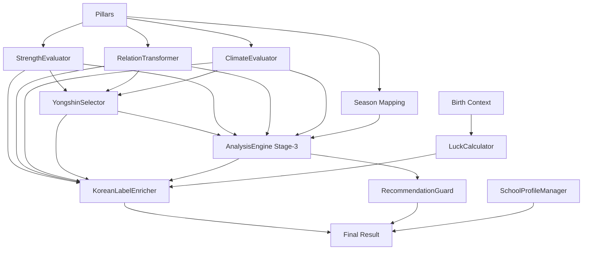

# Saju Orchestrator Design v1.0

**Date:** 2025-10-10 23:00 KST
**Purpose:** Complete design for orchestrator that works with actual engine APIs

---

## Engine Audit Results

### Core Engines (8 engines)

| Engine | Factory Method | Main Method | Input Type | Output Type |
|--------|---------------|-------------|------------|-------------|
| **StrengthEvaluator** | `.from_files()` | `evaluate(**kwargs)` | 11 keyword args | Dict[str, object] |
| **RelationTransformer** | `.from_file()` | `evaluate(ctx)` | RelationContext | RelationResult |
| **ClimateEvaluator** | `.from_file()` | `evaluate(ctx)` | ClimateContext | Dict[str, object] |
| **YongshinSelector** | `__init__()` | `select(input_data)` | Dict | Dict |
| **LuckCalculator** | `__init__()` | `compute(**kwargs)` | pillars, birth_dt, gender, tz | Dict |
| **KoreanLabelEnricher** | `.from_files()` | `enrich(payload)` | Dict | Dict |
| **SchoolProfileManager** | `.load()` | `get_profile(id)` | Optional[str] | Dict |
| **RecommendationGuard** | `.from_file()` | `decide(**kwargs)` | structure_primary | Dict |

### Stage-3 Wrapper

| Engine | Method | Input | Output |
|--------|--------|-------|--------|
| **AnalysisEngine** | `analyze(context)` | Dict with season/strength/relation/climate/yongshin | Dict with 4 engine results |

**Contains 4 sub-engines:**
- ClimateAdvice.run(ctx)
- LuckFlow.run(ctx)
- GyeokgukClassifier.run(ctx)
- PatternProfiler.run(ctx)

---

## Execution Order & Dependencies

```
INPUT: pillars {year, month, day, hour}, birth_context {birth_dt, gender, timezone}
  │
  ├─> Extract basic data (stems, branches, season from month branch)
  │
  ├─> [1] StrengthEvaluator.evaluate()
  │     Needs: month_branch, day_pillar, branch_roots, visible_counts, combos, etc.
  │     Returns: {month_state, branch_root, stem_visible, total, ...}
  │
  ├─> [2] RelationTransformer.evaluate(RelationContext)
  │     Needs: pillars as RelationContext
  │     Returns: RelationResult with relations lists
  │
  ├─> [3] ClimateEvaluator.evaluate(ClimateContext)
  │     Needs: month_branch, segment
  │     Returns: {temp_bias, humid_bias, advice_bucket}
  │
  ├─> [4] YongshinSelector.select(input_data)
  │     Needs: day_master_element, strength, elements_distribution, relations, climate
  │     Returns: {yongshin[], bojosin[], gisin[], confidence, ...}
  │
  ├─> [5] LuckCalculator.compute()
  │     Needs: birth_dt, gender, timezone (pillars NOT used)
  │     Returns: {start_age, direction, prev_term, next_term, ...}
  │
  ├─> [6] AnalysisEngine.analyze(stage3_context)
  │     Needs: {season, strength{phase, elements}, relation{flags}, climate{flags, balance_index}, yongshin{primary}}
  │     Returns: {luck_flow, gyeokguk, climate_advice, pattern}
  │
  ├─> [7] KoreanLabelEnricher.enrich(all_results)
  │     Needs: Combined dict of all previous results
  │     Returns: Enriched dict with *_ko labels
  │
  ├─> [8] SchoolProfileManager.get_profile()
  │     Needs: Optional profile_id
  │     Returns: {id, notes}
  │
  └─> [9] RecommendationGuard.decide()
        Needs: structure_primary (from gyeokguk)
        Returns: {enabled, action, copy}
```

---

## Critical Data Transformations

### Transformation 1: Pillars → StrengthEvaluator inputs

**From:**
```python
pillars = {
    "year": "庚辰",
    "month": "乙酉",
    "day": "癸酉",
    "hour": "丁巳"
}
```

**To:**
```python
strength.evaluate(
    month_branch="酉",           # pillars["month"][1]
    day_pillar="癸酉",           # pillars["day"]
    branch_roots=["辰","酉","酉","巳"],  # all branches
    visible_counts={             # count stems
        "甲": 0, "乙": 1, "丙": 0, "丁": 1,
        "戊": 0, "己": 0, "庚": 1, "辛": 0,
        "壬": 0, "癸": 1
    },
    combos={                     # from RelationTransformer or pre-calc
        "sanhe": 0,
        "he6": 0,
        ...
    },
    # ... 6 more parameters with defaults
)
```

### Transformation 2: Pillars → RelationContext

**From:**
```python
pillars = {"year": "庚辰", "month": "乙酉", "day": "癸酉", "hour": "丁巳"}
```

**To:**
```python
from app.core.relations import RelationContext

ctx = RelationContext(
    year_pillar="庚辰",
    month_pillar="乙酉",
    day_pillar="癸酉",
    hour_pillar="丁巳"
)
relations.evaluate(ctx)
```

### Transformation 3: Results → Stage-3 Context

**From:** (strength, relations, climate, yongshin results)

**To:**
```python
stage3_context = {
    "season": "가을",                    # from month branch mapping
    "strength": {
        "phase": "신강",                 # from strength.evaluate() result
        "elements": {                   # from strength result
            "목": 0.2,
            "화": 0.3,
            "토": 0.1,
            "금": 0.3,
            "수": 0.1
        }
    },
    "relation": {
        "flags": ["chong", "he6"]       # from relations.evaluate() result
    },
    "climate": {
        "flags": [],                    # from climate.evaluate() result
        "balance_index": 1              # calculated or from climate
    },
    "yongshin": {
        "primary": "수"                  # from yongshin.select() result
    }
}
```

### Transformation 4: Elements Distribution for Yongshin

**From:** (pillars + strength result)

**To:**
```python
elements_distribution = {
    "목": count_wood,     # Count from stems/branches + strength adjustments
    "화": count_fire,
    "토": count_earth,
    "금": count_metal,
    "수": count_water
}
```

---

## Missing Context Keys

### What Stage-3 engines need but we don't have:

1. **`climate.balance_index`** - ClimateEvaluator doesn't return this
   - **Solution:** Calculate from temp_bias + humid_bias or default to 0

2. **`relation.flags`** - RelationTransformer returns complex RelationResult
   - **Solution:** Extract relation types that exist (sanhe, he6, chong, etc.)

3. **`strength.elements`** - StrengthEvaluator doesn't return element distribution
   - **Solution:** Calculate from visible_counts + branch roots with element mapping

4. **`yongshin.primary`** - YongshinSelector returns list `yongshin: []`
   - **Solution:** Take first element from yongshin list

---

## Orchestrator Responsibilities

### 1. Input Parsing
- Validate pillars dict has year/month/day/hour
- Parse birth_dt string to datetime if needed
- Extract gender and timezone

### 2. Pillar Decomposition
- Split each pillar into (stem, branch)
- Map month branch → season
- Count stem occurrences
- Collect all branches

### 3. Engine Coordination
- Call engines in dependency order
- Transform outputs to match next engine's inputs
- Handle missing/optional parameters
- Catch and report errors with context

### 4. Context Building
- Build RelationContext from pillars
- Build ClimateContext from month_branch
- Build YongshinSelector input_data from strength+relations+climate
- Build Stage-3 context from all core engine results

### 5. Result Assembly
- Combine all engine results
- Pass to KoreanLabelEnricher
- Add meta information (version, timestamp)
- Return unified response

---

## Orchestrator API Contract

### Input

```python
def analyze(
    self,
    pillars: Dict[str, str],      # {year, month, day, hour} in 60甲子
    birth_context: Dict[str, Any]  # {birth_dt, gender, timezone}
) -> Dict[str, Any]:
```

**pillars keys:**
- `year`: str (e.g., "庚辰")
- `month`: str (e.g., "乙酉")
- `day`: str (e.g., "癸酉")
- `hour`: str (e.g., "丁巳")

**birth_context keys:**
- `birth_dt`: str | datetime (e.g., "2000-09-14T10:00:00")
- `gender`: str (e.g., "M", "F", "male", "female")
- `timezone`: str (optional, default "Asia/Seoul")

### Output

```python
{
    "status": "success" | "error",
    "season": str,                  # "봄", "여름", "가을", "겨울", "장하"

    # Core engine results
    "strength": Dict,               # StrengthEvaluator result
    "relations": Dict,              # RelationTransformer result
    "climate": Dict,                # ClimateEvaluator result
    "yongshin": Dict,               # YongshinSelector result
    "luck": Dict,                   # LuckCalculator result

    # Stage-3 results
    "stage3": {
        "luck_flow": Dict,          # trend, score, drivers, detractors
        "gyeokguk": Dict,           # type, basis, confidence
        "climate_advice": Dict,     # matched_policy_id, advice
        "pattern": Dict             # patterns, briefs
    },

    # Post-processing
    "korean_labels": Dict,          # Enriched Korean labels
    "school_profile": Dict,         # {id, notes}
    "recommendations": Dict,        # {enabled, action, copy}

    # Meta
    "meta": {
        "orchestrator_version": "1.0.0",
        "timestamp": str,           # ISO 8601
        "engines_used": List[str]
    }
}
```

---

## Helper Functions Needed

### 1. Pillar Parsing
```python
def split_pillar(pillar: str) -> Tuple[str, str]:
    """Split 60甲子 pillar into (stem, branch)"""
    return (pillar[0], pillar[1])

def get_season_from_branch(branch: str) -> str:
    """Map branch to season"""
    BRANCH_TO_SEASON = {
        "寅": "봄", "卯": "봄", "辰": "장하",
        "巳": "여름", "午": "여름", "未": "장하",
        "申": "가을", "酉": "가을", "戌": "장하",
        "亥": "겨울", "子": "겨울", "丑": "장하"
    }
    return BRANCH_TO_SEASON.get(branch, "unknown")
```

### 2. Stem/Branch Counting
```python
def count_stems(pillars: Dict[str, str]) -> Dict[str, int]:
    """Count occurrences of each천간"""

def count_elements(stems: List[str], branches: List[str]) -> Dict[str, float]:
    """Calculate element distribution"""
```

### 3. Context Builders
```python
def build_relation_context(pillars: Dict[str, str]) -> RelationContext:
    """Convert pillars dict to RelationContext"""

def build_climate_context(month_branch: str) -> ClimateContext:
    """Build ClimateContext from month branch"""

def build_yongshin_input(
    day_stem: str,
    strength_result: Dict,
    relations_result: RelationResult,
    climate_result: Dict,
    elements: Dict[str, float]
) -> Dict[str, Any]:
    """Build input dict for YongshinSelector"""

def build_stage3_context(
    season: str,
    strength_result: Dict,
    relations_result: RelationResult,
    climate_result: Dict,
    yongshin_result: Dict,
    elements: Dict[str, float]
) -> Dict[str, Any]:
    """Build context for Stage-3 AnalysisEngine"""
```

---

## Error Handling Strategy

### Engine Failures
```python
try:
    strength_result = self.strength.evaluate(...)
except Exception as e:
    return {
        "status": "error",
        "error_stage": "strength_evaluation",
        "error_message": str(e),
        "error_type": type(e).__name__
    }
```

### Partial Results
- If Stage-3 fails, still return core engine results
- If enrichment fails, return un-enriched results
- Always include what succeeded

---

## Implementation Phases

### Phase 1: Core Flow (MVP)
1. ✅ Parse pillars
2. ✅ Call StrengthEvaluator
3. ✅ Call RelationTransformer
4. ✅ Call YongshinSelector (simplified)
5. ✅ Call LuckCalculator
6. ✅ Return basic combined result

**Time:** 1-2 hours

### Phase 2: Stage-3 Integration
1. ✅ Build Stage-3 context properly
2. ✅ Call AnalysisEngine
3. ✅ Include Stage-3 results in output

**Time:** 30 minutes

### Phase 3: Enrichment
1. ✅ Call KoreanLabelEnricher
2. ✅ Add SchoolProfileManager
3. ✅ Add RecommendationGuard
4. ✅ Add meta information

**Time:** 30 minutes

**Total time:** ~3 hours for complete orchestrator

---

## Dependencies Between Engines



---

## Conclusion

**Orchestrator Design Principles:**

1. ✅ **Work with actual engine APIs** - No wrappers, no adapters
2. ✅ **Clear transformation points** - Document each data conversion
3. ✅ **Dependency-ordered execution** - Engines called in correct sequence
4. ✅ **Graceful error handling** - Return partial results when possible
5. ✅ **Complete output** - Include all engine results + meta

**Next Step:** Implement orchestrator based on this design

**Estimated LOC:** ~300-400 lines (with helpers and error handling)

---

**Designed by:** Claude Code
**Date:** 2025-10-10 23:00 KST
**Status:** Design Complete - Ready for implementation
